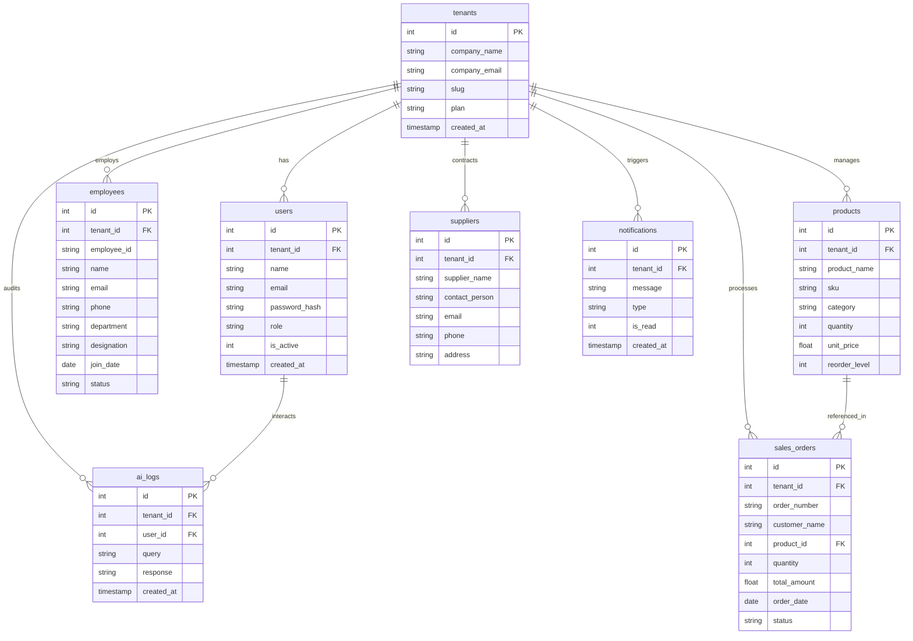

# ERPilot AI: Intelligent Multi-Tenant SaaS ERP Platform

**ERPilot AI** is a premium, production-ready Multi-Tenant SaaS ERP (Enterprise Resource Planning) platform built for small-to-medium businesses. It centralizes core enterprise workflows—Employees, Inventory, Suppliers, and Sales—and integrates a natural language AI Business Assistant powered by Gemini 2.5 Flash.

The application features a sleek, Linear/Apple-inspired monochrome dark UI with glassmorphic cards, smooth transitions, and responsive layouts.

---

## Architecture & Database Design

ERPilot AI enforces strict multi-tenant isolation, database constraints, and performance indexes. The application runs on **SQLite** for local development and fully supports **PostgreSQL** in production environments.

### Database Schema (Mermaid Entity Relationship Diagram)



---

## Key Features

- **Multi-Tenant Architecture**: Robust tenant-level isolation via scoped `tenant_id` filters on all queries and transactional models.
- **Role-Based Access Control (RBAC)**: Distinct permissions for `admin`, `manager`, and `employee` roles.
- **Core ERP Modules**:
  - **Dashboard**: High-level corporate KPI indicators, sales trends, stock distribution, and an active event timeline.
  - **Employee Management**: CRUD tracking of employee IDs, departments, join dates, and contact details.
  - **Inventory Catalog**: Product properties (SKU, Category, Qty, Unit Price) with automatic low-stock alerts.
  - **Supplier Management**: Standard supplier lookup directories.
  - **Sales Orders**: Atomic stock check and deduction on purchase, total amount revenue calculations, and stock restoration on order cancellation.
  - **AI Assistant**: Natural language querying over the company's real-time inventory, employees, and sales.
  - **Reporting Hub**: Export CSV, Excel (`openpyxl`), and PDF (`reportlab`) documents for all four data modules.

---

## Tech Stack

| Layer | Technology |
|---|---|
| **Frontend** | HTML5, Vanilla CSS, JavaScript, Bootstrap 5, Chart.js, Google Fonts (Inter) |
| **Backend** | Python 3.13, Flask (Blueprints, Request Filters, Custom Decorators) |
| **Database** | SQLite (Dev) / PostgreSQL (Prod) via `psycopg2-binary` |
| **ORM** | SQLAlchemy (Models defined in `models.py`) |
| **AI Integration** | Google AI Studio (Gemini 2.5 Flash), `google-genai` SDK |

---

## Local Setup

### 1. Prerequisites
- Python 3.13 or higher

### 2. Installation
```bash
git clone https://github.com/Iamgokul7/ERPilot-AI.git
cd ERPilot-AI
python -m venv .venv
# On Windows
.venv\Scripts\pip install -r requirements.txt
# On macOS/Linux
.venv/bin/pip install -r requirements.txt
```

### 3. Environment variables
Create a `.env` file in the root:
```env
GEMINI_API_KEY=your_gemini_api_key_here
DATABASE_URL=sqlite:///instance/erpilot.db
```

### 4. Database Initialization & Seeding
```bash
.venv\Scripts\python database.py
```

### 5. Running App
```bash
.venv\Scripts\python app.py
```

### 6. Automated Testing (Pytest Suite)
```bash
.venv\Scripts\python -m pytest -v --cov=.
```

---

## Docker & docker-compose Support

To run the full stack locally with both a Flask container and a PostgreSQL database container:

1. Add your `GEMINI_API_KEY` to the Environment.
2. Spin up containers:
```bash
docker-compose up --build
```
This runs the Flask server on `http://localhost:5000` connected to PostgreSQL on port `5432`, with persistent volume mappings.

---

## Production Deployment (Render / Railway)

1. Provisions a PostgreSQL database on your hosting platform.
2. Set the `DATABASE_URL` environment variable to point to the PostgreSQL connection string.
3. Set `GEMINI_API_KEY` environment variable.
4. Execute `python database.py` on build command to automatically generate schemas and indexes.
